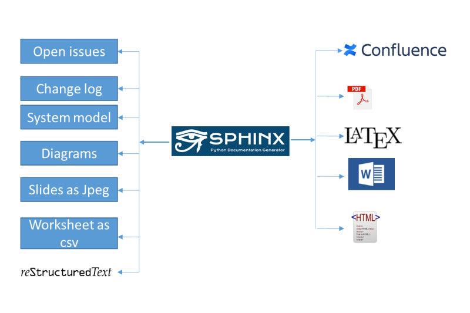

.. _doc_as_code_manual:

Doc-As-Code user manual
+++++++++++++++++++++++

This aim of this document is to forecast

#. What is doc as code and How it works
#. How to use onboarding template to get hands-on experience with reStructuredText
#. How to publish documents locally

.. contents:: Table of contents
    :local:

What is doc as code
===================

.. glossary::
    :sorted:

    Docs as Code
      Documentation as Code (Docs as Code) refers to a philosophy that the documentation will be \
      written with the same tools as code

How it works
============

Before understanding how doc as code works, it is required to become familiar with the \
following terms

- **reStructuredText** [1]_ (RST, ReST, or reST) is a file format for textual data used primarily \
  in the Python programming language community for technical documentation.

- **Sphinx** [2]_ is a documentation generator written and used by the Python community. It is \
  written in Python, and also used in other environments.

- **Conan** [3]_ is a software package manager which is intended for C and C++ developers..

Workflow
--------

- The doc-as-code manual will be written down using restructured.
- The doc source will be built using python packages called conan and sphinx.

Big picture
-----------

The following images forecasts simple workflow how doc-as-code toolchain using sphinx and conan \
generates the document using reStructuredText and other entities into possible target types.

.. attention::

    The following image shows the capabilities of doc as code toolchain. It does not mean \
    the current status. So please do not get confused.

doc as code
===========

The doc as code provides the step by step instructions to generate the documentation.

Related Chapters
================

.. toctree::
   :maxdepth: 1

   prerequisites
   how-to_use_onboarding_template
   how-to_configure_doc_as_code_folder_structure
   how-to_configure_conanfile
   how-to_publish_documents
   user_guide
   known_issues_onboarding_template
   miscellaneous

.. only:: builder_html

   * :ref:`genindex`
   * :ref:`glossary`

Overview of related chapters
----------------------------

To make sure that, the content of this manual will be read and understood as quick as possible, \
a brief overview will be documented here.

.. list-table:: Overview of related chapters
   :widths: auto
   :header-rows: 1

   * - Link
     - Significance
   * - :ref:`prerequisites`
     - - What is required to use onboarding template
       - Which tools or editors etc
   * - :ref:`how-to_use_onboarding_template`
     - - To get hands-on experience
       - How to edit onboarding template
       - what to do in order to include my document
   * - :ref:`how-to_configure_doc_as_code_folder_structure`
     - - to configure doc-as-code base from scratch
       - what to modify to build new doc-as-code base
   * - :ref:`how-to_configure_conanfile`
     - - what to modify in conanfile
       - standard attributes of conan
       - customized attributes
   * - :ref:`how-to_publish_documents`
     - - Rendering onboarding template to html
       - Publishing mechanism to confluence
       - Rendering onboarding template to pdf
   * - :ref:`User guide reStructuredText <user_guide>`
     - - syntax of restructured text
       - Examples of individual syntax
   * - :ref:`known_issues_onboarding_template`
     - - Known issues
       - work around

.. rubric:: Footnotes

.. [1] Related documentation `restructured <https://en.wikipedia.org/wiki/ReStructuredText>`_
.. [2] Related documentation `Sphinx <https://en.wikipedia.org/wiki/Sphinx_(documentation_generator)>`_
.. [3] Related documentation `Conan <https://docs.conan.io/en/latest/>`_