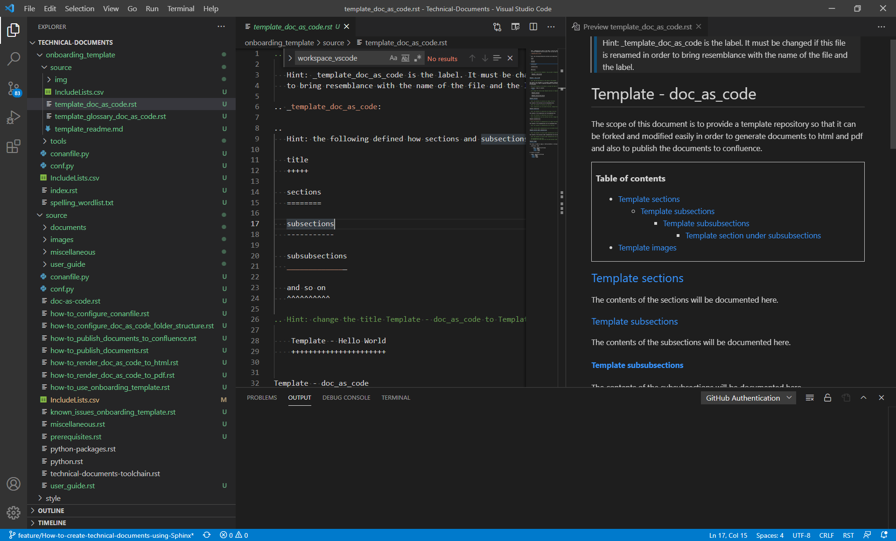

.. _how-to_use_onboarding_template:

How to use onboarding template
++++++++++++++++++++++++++++++

This page is intended to provide the instructions on how to use the onboarding template in order \
to get hands on experience.

.. contents:: Table of contents
    :local:

Prerequisites
=============

.. note::

    Please do not perform any steps if you have not installed the required prerequisites. For more \
    info, please visit :ref:`Prerequisites <prerequisites>`

    If you are new to reStructuredText and Sphinx, please read \
    the :ref:`user_guide <user_guide>`

Repository (to fork the source code)
====================================

#. open conemu

.. code-block:: bash

    git clone https://github.com/SiANOMTech/Technical-Documents.git
    cd Technical-Documents
    git checkout develop

Folder structure
================

- The folder structure of the onboarding template is as follows

.. code-block:: bash

    onboarding_template/
    Readme.md

where

- onboarding_template is the ready to use template folder and is the place holder to begin with \
  the modifications

Folder structure onboarding_template
------------------------------------

.. code-block:: bash

    source
    style
    tools
    conanfile.py
    conf.py
    IncludeLists.csv
    index.rst
    spelling_wordlist.txt

where

- source: a folder which contains the ready to use reStructuredText files.
- style: style sheets and themes
- tools: contains plantuml.jar
- conanfile.py: provides a privilege either render the doc (in .rst) to html file or to publish \
  the documents to confluence
- conf.py: is the configuration file which translates the .rst files to html or it will publish the \
  documents to confluence
- IncludeLists.csv: is the csv file which decides where to include a documentation file or a folder \
  while generating the documentation. Please stick to the existing format of IncludeLists.csv \
  while adding new files and folders. Make sure that the value of newly added file or folder in \
  IncludeLists.csv is set to True connected to the column publish_confluence when documentation \
  should be published to confluence.
- index.rst: is the reStructuredText file which serves the welcome page
- spelling_wordlist.txt: A placeholder to ignore technical terms while checking spelling mistakes

Folder structure onboarding_template/source
-------------------------------------------

.. code-block:: bash

    img/
    template_doc_as_code.rst
    template_glossary_doc_as_code.rst
    template_readme.md

where

- img: placeholder to store the images
- template_doc_as_code.rst: is the reStructuredText file and from here the actual documentation \
  can begin 
- template_glossary_doc_as_code.rst: is the reStructuredText file and it will be used to add new \
  glossaries
- template_readme.md: ready to use markdown file

Where and what to modify
========================

.. note::

    Use any editor of your choice. Visit :ref:`Prerequisites <prerequisites>` and follow the \
    instructions under the chapter **Installation Guide**.
    In this chapter, it is will be demonstrated using VSCode.

Viewing the contents using vscode
---------------------------------

1. open VScode from the location where Repository is cloned from command prompt as shown below.

.. code-block:: bash

    code .

2. As shown in the following image, the contents of the repository and the source file and it's \
   Preview mode are highlighted.

    Preview the contents of Repository

Rename the template file
------------------------

.. note::

    It is not recommended to use the template file with the same name to avoid the conflicts.

- Change the name of the template files as follows

    - template_doc_as_code.rst to template_hello_world.rst
    - template_glossary_doc_as_code.rst to template_glossary_hello_world.rst
    - template_readme.md to template_readme_hello_world.md

Update the toctree
__________________

Now the file which has been renamed should be included in index.rst.

Contents before modification in index.rst

.. code-block:: bash

    Contents:

    .. toctree::
       :maxdepth: 2

       template_doc_as_code
       template_glossary_doc_as_code
       template_readme

Contents after modification in index.rst

.. code-block:: bash

    Contents:

    .. toctree::
       :maxdepth: 2

       template_hello_world
       template_glossary_hello_world
       template_readme_hello_world

Update the IncludeLists.csv
___________________________

.. note::

    It is important to know the significance of IncludeLists.csv file as it plays a pivotal role \
    to render the same source of documentation to different target types.

What is IncludeLists.csv
^^^^^^^^^^^^^^^^^^^^^^^^

The IncludeLists.csv is the csv file (partly inspired from the role of CMakeLists.txt of CMake \
tool). The IncludeLists.csv gathers the source files and the requirement to publish the document \
to different target types from one source code.

Modifying the IncludeLists.csv
^^^^^^^^^^^^^^^^^^^^^^^^^^^^^^
Contents before modification in IncludeLists.csv

.. code-block:: bash

    #file_name;generate_html;publish_confluence;generate_pdf;
    template_doc_as_code.rst;True;True;True;
    template_glossary_doc_as_code.rst;True;True;True;
    template_readme.md;True;True;True;

Contents after modification in IncludeLists.csv

.. code-block:: bash

    #file_name;generate_html;publish_confluence;generate_pdf;
    template_hello_world.rst;True;True;True;
    template_glossary_hello_world.rst;True;True;True;
    template_readme_hello_world.md;True;True;True;

Modifying the contents
----------------------

.. note::

    Eventually it requires to modify the contents only in template_glossary_doc_as_code.rst, \
    IncludeLists.csv, index.rst and template_doc_as_code.rst

- Every reStructuredText (\*.rst) is equipped with the comments.
- Every comment in the reStructuredText is a hint and these comments mention what to be changed.
- the following comment from template_doc_as_code.rst describes to change the label.

.. code-block:: bash

    .. Hint onboarding_guide - the following defines a label so that it can be used as reference \
       in other documents. 

.. note::

    In order to use the onboarding template as effective as possible, all the comments will begin \
    with a key word **Hint onboarding_guide**. To know all hints at once, this key word can be \
    marked recursively in editors like notepad++

- For example after renaming the template_doc_as_code.rst to template_hello_world.rst, it is required \
  to rename the label. Renaming the label makes sure that label and the name of the file \
  are synchronized. This change is optional but it is highly recommended.

declaration of label in **template_hello_world.rst** before modification

.. code-block:: bash

    .. _template_doc_as_code:

declaration of label in **template_hello_world.rst** after modification

.. code-block:: bash

    .. _template_hello_world:

- Likewise all the comments or hint texts must be read and the content should be modified \
  accordingly in template_glossary-hello_world.rst too.

Related chapters
================

.. note::

    If you have got the hands on experience with onboarding_template with respect to changing the \
    existing **.rst** files, adding new files and adjusting IncludeLists.csv, then the following \
    related chapters will navigate you what to do next

#. How to configure doc-as-code folder structure, visit \
   :ref:`how-to_configure_doc_as_code_folder_structure`
#. How to configure conanfile, visit :ref:`how-to_configure_conanfile`
#. How to render doc as code to html (Publish to HTML), visit :ref:`how-to_render_doc_as_code_to_html`
#. How to publish documents to Confluence, visit :ref:`how-to_publish_documents_to_confluence`
#. How to render doc as code to pdf (Publish to PDF), visit :ref:`how-to_render_doc_as_code_to_pdf`
#. How to configure doc-as-code from scratch, visit :ref:`how-to_configure_doc_as_code_folder_structure`
