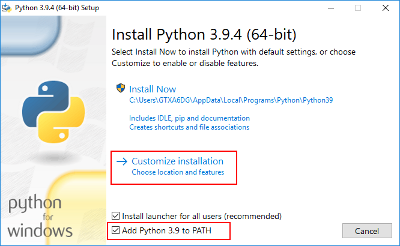
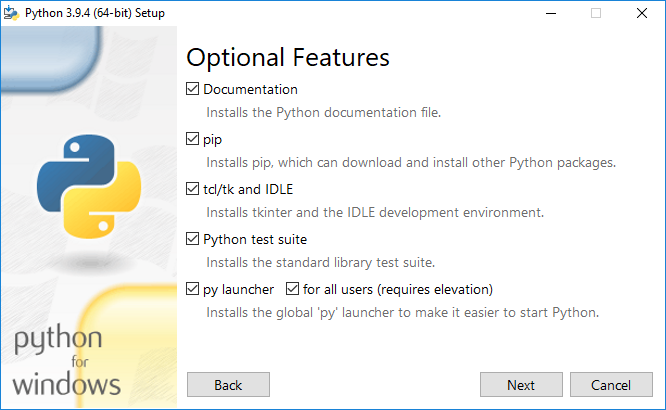
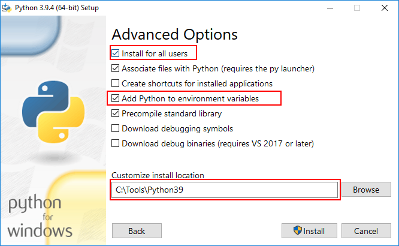
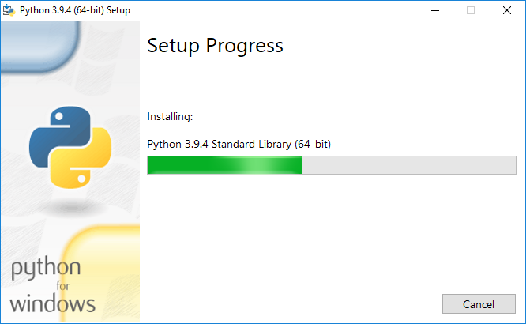
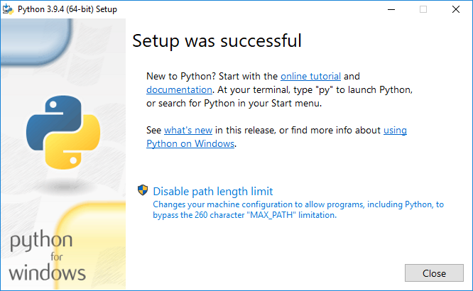
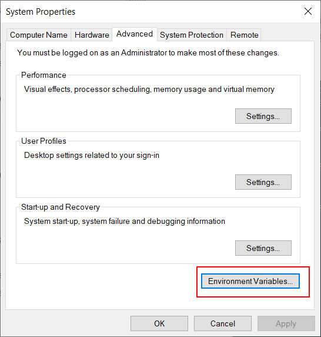
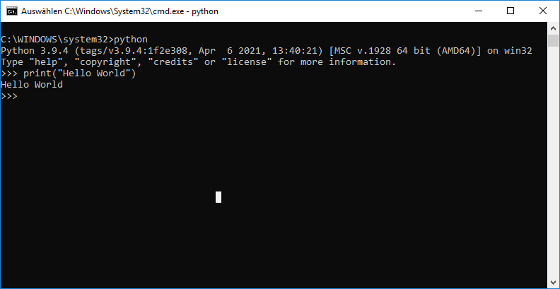

.. _python:

Python
++++++

.. contents:: Table of contents 
    :local:

What is Python
==============

#. Python is an interpreted, object-oriented, high-level programming language with dynamic \
   semantics.

Why it is required?
===================

#. Python along with additional packages will be used to generate the technical documentation to \
   any format. So it is a prerequisite to install the python.

How to install
==============

#. Download the latest version from \
   `https://www.python.org/downloads/ <https://www.python.org/downloads/>`_

.. hint::

    Based on the system configuration the name of the executable will be different. In this \
    document the executable is named as **python-3.9.4-amd64.exe**

- Go to the location where executable **python-3.9.4-amd64.exe** is located.

- Run the downloaded file **python-3.9.4-amd64.exe**.

- Make sure that the option **Add Python 3.9 to PATH** is selected. Run the option \
  **Customize installation**

- Make sure that the options **Install for all users** and **Add Python to environment variables** \
  are selected. Change the **Customize install location** to **C:\\Tools\\Python39**. Click \
  **Install**

How to add Python to environment variables
==========================================

- Go to start menu and type **System environment variables** and click ** Environment Variables**

- As highlighted below, make sure that python executable path **python.exe** and python scripts \
  path **pip.exe** will be added to path.

How to verify if Python is installed correctly
==============================================

Python version
--------------

- Open command prompt and check the python version as follows

.. code-block:: bash

    python --version

- The outcome of the command should be as shown below

.. code-block:: bash

    Python 3.9.4

Pip version
-----------

- Run the following command

.. code-block:: bash

    pip3 --version

.. code-block:: bash

    pip 20.2.3 from c:\tools\python39\lib\site-packages\pip (python 3.9)

Hello world using python
========================

- Open command prompt. Run the following command

.. code-block:: bash

    python

- The outcome of the command should be as shown below

.. code-block:: bash

    C:\WINDOWS\system32>python
    Python 3.9.4 (tags/v3.9.4:1f2e308, Apr  6 2021, 13:40:21) [MSC v.1928 64 bit (AMD64)] on win32
    Type "help", "copyright", "credits" or "license" for more information.
    >>> 

- Write down the following content in python interpreter

.. code-block:: bash

    print("Hello World")

- The outcome of the command should be as shown below

Related articles
================

#. `What is Python? Executive Summary <https://www.python.org/doc/essays/blurb/>`_

