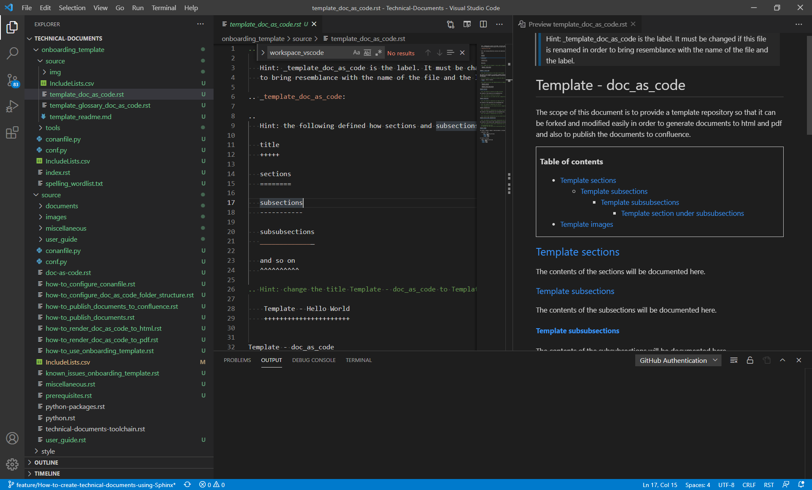
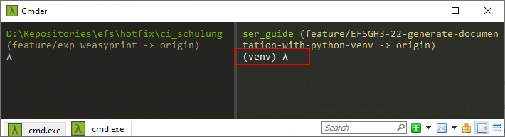

.. _how-to_use_onboarding_template:

How to use onboarding template
++++++++++++++++++++++++++++++

This page is intended to provide the instructions on how to use the onboarding template in order \
to get hands on experience.

.. contents:: Table of contents
    :local:

Prerequisites
=============

.. note::

    Please do not perform any steps if you have not installed the required prerequisites. For more \
    info, please visit :ref:`Prerequisites <prerequisites>`

    If you are new to reStructuredText and Sphinx, please read \
    the :ref:`user_guide <user_guide>`

Repository (to fork the source code)
====================================

#. open Cmder

.. code-block:: bash

    git clone https://github.com/SiANOMTech/Technical-Documents.git
    cd Technical-Documents
    git checkout develop

Folder structure
================

- The folder structure of the onboarding template is as follows

.. code-block:: bash

    onboarding_template/
    user_guide/

where

- onboarding_template is the ready to use template folder and is the place holder to begin with \
  the modifications

Folder structure onboarding_template
------------------------------------

.. code-block:: bash

    conanfile.py
    conf.py
    IncludeLists.csv
    index.rst
    source/
    style/
    tools/
    requirements.txt

- conanfile.py provides a privilege either render the doc (in .rst) to html file or to publish \
  the documents to confluence
- conf.py is the configuration file which translates the .rst files to html or it will publish the \
  documents to confluence
- IncludeLists.csv is the csv file which decides where to include a documentation file or a folder \
  while generating the documentation. Please stick to the existing format of IncludeLists.csv \
  while adding new files and folders. Make sure that the value of newly added file or folder in \
  IncludeLists.csv is set to True connected to the column publish_confluence when documentation \
  should be published to confluence.
- index.rst 

    - master document 
    - serves welcome page
    - used to connect multiple files to a single hierarchy of documents

- source : a place holder which contains the literature. It is recommended to add new files or \
  modify the existing files under this folder
- style : a place holder which contain style sheet and themes
- tools : contains plantuml.jar in order to generate class diagram.
- requirements.txt : contains all the required python packages to generate the documentation.

.. code-block:: bash

    images
    IncludeLists.csv
    spelling_wordlist.txt
    template_doc_as_code.rst
    template_glossary_doc_as_code.rst
    template_readme.md

where

- images : a place holder to store the images
- template_glossary_doc_as_code.rst : a ready to use template file which contains glossaries
- template_doc_as_code.rst : a ready to use template file which contains hierarchy of chapters and subchapters
- template_readme.md : a ready to use markdown file

Viewing the contents using vscode
=================================

1. Using Cmder, open VScode from the location where Repository is cloned using the command as \
   shown below.

.. code-block:: bash

    code .

2. As shown in the following image, the contents of the repository and the source file and it's \
   Preview mode are highlighted.

    Preview the contents of Repository

How to build onboarding_template
================================

#. Go to the folder (no matter existing doc-as-code template or new doc-as-code base) where \
   conanfile.py is located.
#. Perform the following steps.

    .. code-block:: bash

        cd Technical-Documents/doc_as_code/onboarding_template
        python -m venv ./venv
        .\venv\Scripts\activate.bat
        pip install -r requirements.txt
        conan install . -if build
        conan build . -bf build
        .\venv\Scripts\deactivate.bat

The above working steps generate the html files under the directory \
**build\\package\\Doc_as_Code_Tools-DocumentsHtml\\**.

**index.html** serves the welcome page. It can be opened in any browser apart from \
**Internet explorer** in order to visualize the contents.

#. Read :ref:`how-to_publish_documents` to know more on where generated documents will be located.

Meaning behind individual commands
==================================

- **cd Technical-Documents/onboarding_template**: change the current working directory to \
  onboarding_template
- **python -m venv ./venv**: creates a new virtual environment. It is required to create the \
  virtual environment if not exists. Please stick to the name **venv** in order ignore spell check \
  for the contents within this folder.

- **.\\venv\\Scripts\\activate.bat**:  activates the python virtual environment. The following images \
  how Cmder terminal looks without (left half) and with (right half) activated python virtual \
  environment.

- **pip install -r requirements.txt**: Installs the required python packages. Once installed in \
  python virtual environment, it is not required to install again.

- **conan install . -if build**: creates a build folder and installs the requirements.
- **conan install . -bf build**: builds (generates) the documentation from the source code.
- **.\\venv\\Scripts\\deactivate.bat**: deactivates the python virtual environment.

Related chapters
================

.. note::

    If you have got the hands on experience with onboarding_template with respect to changing the \
    existing **.rst** files, adding new files and adjusting IncludeLists.csv, then the following \
    related chapters will navigate you what to do next

#. How to configure doc-as-code folder structure, visit \
   :ref:`how-to_configure_doc_as_code_folder_structure`
#. How to configure conanfile, visit :ref:`how-to_configure_conanfile`
#. How to render doc as code to html (Publish to HTML), visit :ref:`how-to_render_doc_as_code_to_html`
#. How to render doc as code to pdf (Publish to PDF), visit :ref:`how-to_render_doc_as_code_to_pdf`
#. How to configure doc-as-code from scratch, visit :ref:`how-to_configure_doc_as_code_folder_structure`
