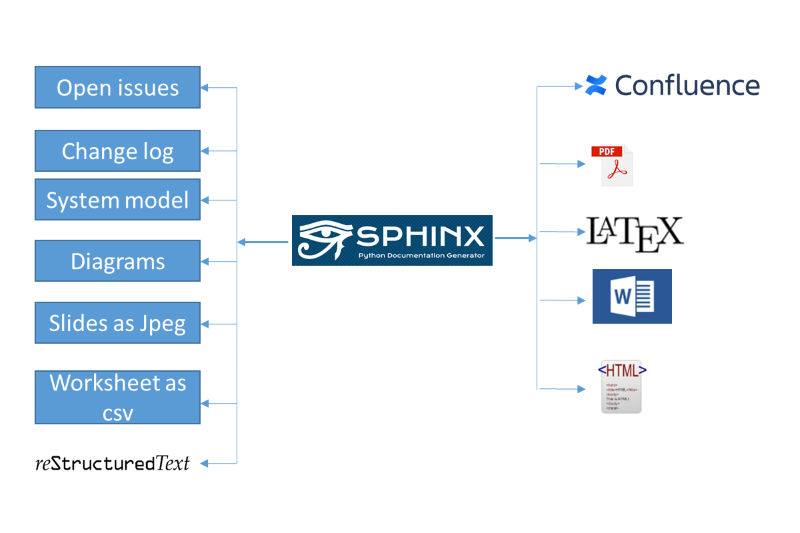

.. _introduction:

Introduction
++++++++++++

This aim of this document is to forecast

#. What is doc-as-code and How it works
#. How to use onboarding template to get hands-on experience with reStructuredText
#. How to publish documents locally

.. contents:: Table of contents
    :local:

What is doc-as-code
===================

.. glossary::
    :sorted:

    Docs as Code
      Documentation as Code (Docs as Code) refers to a philosophy that the documentation will be \
      written with the same tools user for developing the code.

Terminology
===========

Before understanding how doc-as-code works, it is required to become familiar with the \
following terms

- **reStructuredText** [1]_ (RST, ReST, or reST) is a file format for textual data used primarily \
  in the Python programming language community for technical documentation.

- **Sphinx** [2]_ is a documentation generator written and used by the Python community. It is \
  written in Python, and also used in other environments.

- **Conan** [3]_ is a software package manager which is intended for C and C++ developers. Conan \
  will allow to generate the documentation to different targets using the same source code. The \
  conan build mechanism will segregate the outcome of different builds to verify the document \
  easily. It will also provide the environment variables to **conf.py** so that **conf.py** will be \
  kept untouched.

- **Chocolatey** [4]_ Chocolatey has the largest online registry of Windows packages. Chocolatey \
  will allow to install python without admin rights.

- **Cmder** [5]_ Console emulator with pre-integrated git (Git for windows). It also supports \
  linux based commands in windows.

- **conf.py** [6]_ This file (containing Python code) is called the “build configuration file” and \
  contains (almost) all configuration needed to customize Sphinx input and output behavior.

- **Miktex** [7]_ MiKTeX is a modern TeX distribution for Windows. MiKTeX's integrated package \
  manager installs missing components from the Internet, if required.

- **Python Virtual Environment** [8]_ a self-contained directory tree that contains a Python \
  installation and the additional packages.

- **docToolchain** [9]_ is an implementation of the doc-as-code approach.

How it works
============

- The doc-as-code manual will be written down using reStructuredText.
- The doc source will be built using python virtual environment which contains required python \
  packages.
- The build mechanism uses conan to provide necessary parameters to conf.py so that documents \
  for different target will be generated and segregated.
- If build target is pdf, the conan renders the documentation source to latex first and user miktex \
  latex distribution to convert the latex to pdf.

Big picture
-----------

The following images shows a simple workflow on how the EFS-GH3 toolchain is using sphinx, conan, \
CICD to generate documents or other possible target types using reStructuredText.

    Workflow: document generation mechanism using doc-as-code and docToolchain.

Further information
===================

The doc-as-code offers the relevant information regarding the following

- How to implement doc-as-code methodology
- What are the prerequisites
- How to automate publishing documentation to different targets

.. only:: builder_html

   * :ref:`genindex`
   * :ref:`glossary`

Overview of related chapters
----------------------------

To enable easy navigation, an overview with related chapters and a short summary is given below.

.. list-table:: Overview of related chapters
   :widths: auto
   :header-rows: 1

   * - Link
     - Significance
   * - :ref:`prerequisites`
     - - What is required to use onboarding template
       - Which tools or editors etc
   * - :ref:`how-to_use_onboarding_template`
     - - To get hands-on experience
       - How to edit onboarding template
       - What to do in order to include my docu
   * - :ref:`how-to_configure_doc_as_code_folder_structure`
     - - To configure doc-as-code base from scratch
       - What to modify to build new doc-as-code base
   * - :ref:`how-to_configure_conanfile`
     - - What to modify in conanfile
       - Standard attributes of conan
       - Customized attributes
   * - :ref:`how-to_publish_documents`
     - - Rendering onboarding template to html
       - Publishing mechanism to confluence
       - Rendering onboarding template to pdf
   * - :ref:`how-to_check_spellings`
     - - Quality checks
       - Spellings mistakes
       - How to include filters
   * - :ref:`User guide reStructuredText <user_guide>`
     - - Syntax of restructured text
       - Examples of individual syntax
   * - :ref:`known_issues_onboarding_template`
     - - Known issues
       - Work around

.. rubric:: Footnotes

.. [1] Related documentation `reStructuredText <https://en.wikipedia.org/wiki/ReStructuredText>`_
.. [2] Related documentation `Sphinx <https://en.wikipedia.org/wiki/Sphinx_(documentation_generator)>`_
.. [3] Related documentation `Conan <https://docs.conan.io/en/latest/>`_
.. [4] Related documentation `Chocolatey <https://community.chocolatey.org/>`_
.. [5] Related documentation `Cmder <https://cmder.net/>`_
.. [6] Related documentation `conf.py <https://www.sphinx-doc.org/en/master/usage/configuration.html>`_
.. [7] Related documentation `Miktex <https://miktex.org/>`_
.. [8] Related documentation `venv <https://docs.python.org/3/tutorial/venv.html>`_
.. [9] Related documentation `docToolchain <https://doctoolchain.github.io/docToolchain/v1.3.x/>`_
