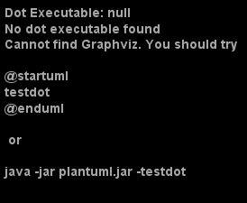

.. _known_issues_onboarding_template:

Known issues onboarding template
++++++++++++++++++++++++++++++++

This page is intended to document the known issues of the document publish mechanism to confluence \
using doc-as-code toolchain.

.. contents:: Table of contents
    :local:

WARNING: height value for image is unsupported in confluence
============================================================

Definition
----------

.. code-block:: bash

    ..\Technical-Documents\source\how-to_use_onboarding_template.rst:: WARNING: height value for image is unsupported in confluence

Workaround
----------

- if you are using the images with captions, such warning message will be generated.
- It can be either ignored or image directive without caption can be used

WARNING: unknown code language: rest
====================================

Definition
----------

.. code-block:: bash

    ..\Technical-Documents\source\prerequisites.rst:: WARNING: unknown code language: rest

Workaround
----------

- possible cause is the code-block **rest** would have been used as shown below

.. code-block:: bash

    .. code-block:: rest

- Use code-block **bash** instead as shown below

.. code-block:: bash

    .. code-block:: bash

! Missing $ inserted
====================

While generating the documentation to pdf format, the following error may occur::

    (DocAsCodeManaul.out) (DocAsCodeManaul.out)

    Package hyperref Warning: Token not allowed in a PDF string (Unicode):
    (hyperref)                removing `subscript' on input line 85.

    Package hyperref Warning: Token not allowed in a PDF string (Unicode):
    (hyperref)                removing `subscript' on input line 85.

    (C:\Tools\MiKTeX 2.9\tex/latex/psnfss\t1phv.fd)
    ! Missing $ inserted.
    <inserted text>
                    $
    l.85 \sphinxmaketitle

The possible cause could be, the title of the document may contain multiple **_**. It should be \
replaced by **-**.

For example,

the actual configuration in conf.py to generate the document to tex format can be as shown below.

.. code-block:: python

    latex_documents = [
        (master_doc, 'DocAsCodeManaul.tex', 'Doc_As_CodeManaul',
         'Generated by Veeresh Katageri', 'manual'),
    ]

It should be replaced by

.. code-block:: python

    latex_documents = [
        (master_doc, 'DocAsCodeManaul.tex', 'Doc-As-CodeManaul',
         'Generated by Veeresh Katageri', 'manual'),
    ]

WARNING: plantuml command 'java -jar plantuml.jar' cannot be run
================================================================

In order to generate integrate the plantuml diagrams, it is required to install the java. Please \
find the instructions to install java \
`Printable Version
What is the offline method for downloading and installing Java for a Windows computer? <https://java.com/en/download/help/windows_offline_download.html>`_

.. _java_version:

How to check if java is installed?
----------------------------------

Open cmd or go to a terminal and then run the following command

.. code-block:: bash

    java -version

The outcome should be as shown below.

.. code-block:: bash

    java version "1.8.0_271"
    Java(TM) SE Runtime Environment (build 1.8.0_271-b32)
    Java HotSpot(TM) 64-Bit Server VM (build 25.271-b32, mixed mode)

No dot executable found
=======================

The following error may occur if graphviz is not installed.

- Go to `Graphviz - Graph Visualization Software <https://graphviz.org/about/>`_ for more info and \
  install graphviz properly.
- If the platform is windows, please choose a stable version.