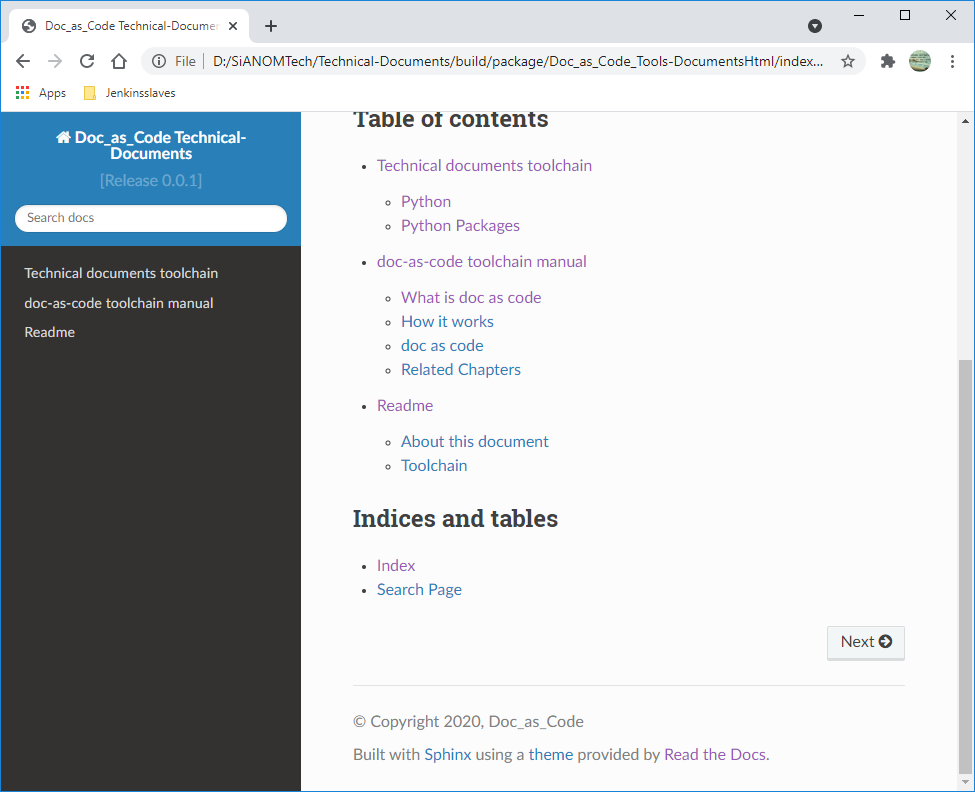

.. _glossary:

Glossary
++++++++

This page is intended to show how **Glossary** can be used to documentation using reStructuredText \
syntax.

.. contents:: Table of contents
    :local:

Defining a glossary
===================

This directive must contain a reST definition-list-like markup with terms and definitions. \
The definitions will then be referenceable with the term role. Example:

The following will be an example to showcase how glossary was written for MT4 toolchain

.. code-block:: bash

    .. glossary::
        :sorted:

            Sphinx
              Sphinx is a tool that makes it easy to create intelligent and beautiful documentation. It was originally created for the Python documentation, and it has excellent facilities for the documentation of software projects in a range of languages.

            Conan
              Conan is a dependency and package manager for C and C++ languages. It is free and open-source, and it works in all platforms: Windows, Linux, OSX, FreeBSD, Solaris, etc. and can be used to develop for all targets including embedded, mobile (iOS, Android), bare metal. It also integrates with all build systems like CMake, Visual Studio (MSBuild), Makefiles, SCons, etc., including proprietary ones. More information about conan can be found [#conan.io]_.

It yields to

.. glossary::
    :sorted:

    Sphinx
      Sphinx is a tool that makes it easy to create intelligent and beautiful documentation. It was originally created for the Python documentation, and it has excellent facilities for the documentation of software projects in a range of languages.

    Conan
      Conan is a dependency and package manager for C and C++ languages. It is free and open-source, and it works in all platforms: Windows, Linux, OSX, FreeBSD, Solaris, etc. and can be used to develop for all targets including embedded, mobile (iOS, Android), bare metal. It also integrates with all build systems like CMake, Visual Studio (MSBuild), Makefiles, SCons, etc., including proprietary ones. More information about conan can be found [#conan.io]_.

Using glossary
==============

In documentation
----------------

In this block it will be shown how glossary will be used in sphinx documentation

:term:`Sphinx`

:term:`Conan`

:term:`Docs as Code`

Shortcuts powered by Sphinx
---------------------------

- Using reStructuredText directive **only**, the glossary can be access easily. \
  The modification is only required at the index.html page.
- The following code snippet shows the required changes

.. code-block:: rest

    .. only:: builder_html

       * :ref:`genindex`
       * :ref:`glossary`

- These changes will be resulted to two separate subchapters called **Index** and **Glossary** at \
  the homepage of the documentation.

    Welcome page displays the Glossary and Index as shortcuts at the bottom

- The chapter **Glossary** navigates to the chapter where glossaries are defined.
- The chapter **Index** will navigate to a separate page which has been generated by sphinx where \
  it lists all glossaries alphabetically.

.. rubric:: Footnotes

.. [#conan.io] Official documentation of conan be found here `conan <https://docs.conan.io/en/latest/>`_.
