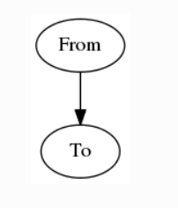
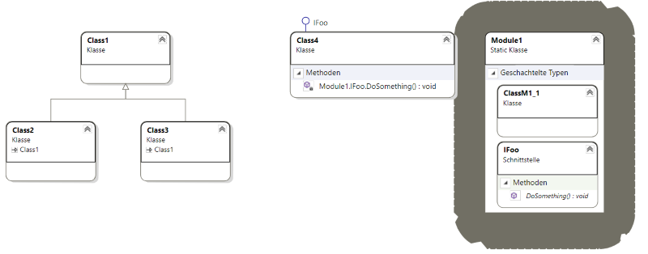
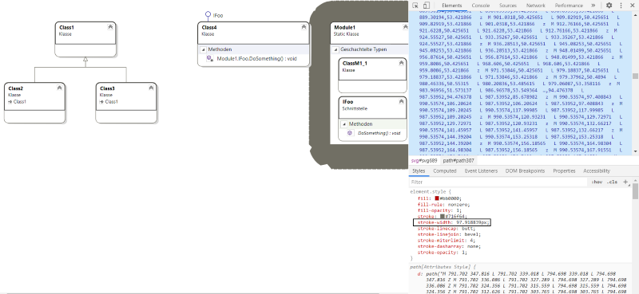
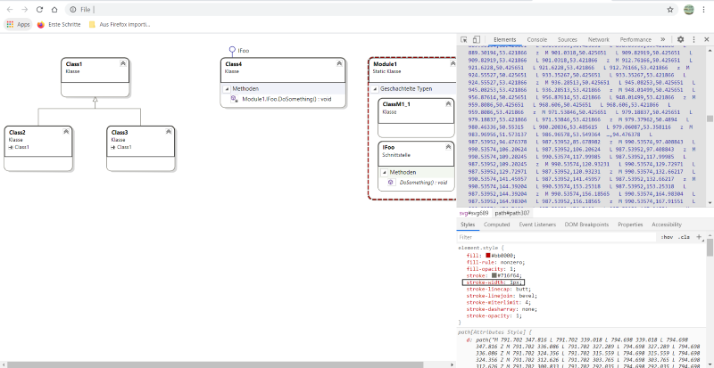

.. _images:

Images
++++++

This page is intended to show how **Images** can be used to documentation using \
reStructuredText syntax.

.. contents:: Table of contents
    :local:

Supported image formats
=======================

#. jpeg
#. png
#. svg
#. plantuml
#. graphviz
#. emf

How to embed images in sphinx docs
==================================

It is required to identify

#. where the image file is located
#. in which source documentation (reStructuredText or markdown), it should be embedded.

The following code-block shows the folder structure of the parent directory of image and parent \
directory of documentation source file.

.. code-block:: bash

    images/doc-as-code/master_oogway.jpg
    user_guide/images.rst

in reStructuredText
-------------------

The path to the image is always relative to the file. In this document, the images used are stored \
under the folder **doc_source_doc_as_code\images**. For example if you refer
:ref:`images_without_caption`, the image directive has been used as follows

.. code-block:: bash

    .. image:: ../images/doc-as-code/master_oogway.jpg

As the folder images has been located one level above compared to the directory of this document, \
the relative path has been used to embed the image in this document.

in Markdown
-----------

.. attention::

    No markdown file has been used in this repository. The following explaination has been \
    experimented using doc as code blueprint repository.

.. code-block:: bash

    

Syntax
======

The normal sphinx supports the image formats of .jpeg, .png and .svg. The images can be added with \
and without captions.

jpeg and png
------------
The general syntax to integrate the images is

.. code-block:: bash

    .. image:: stars.jpg
        :width: 200px
        :align: center
        :height: 100px

where the dimension will be mentioned by **:width:** and **:height:**. And alignment will be \
adjusted the rest field **:align:**

.. _images_without_caption:

Images without caption
______________________

The following is an example of inserting an image without caption into document.

.. code-block:: bash

    .. image:: ../images/doc-as-code/master_oogway.jpg
        :width: 800px
        :align: center
        :height: 533px

And it yields to

Images with caption
___________________

The following is an example of inserting an image with caption into document.

.. code-block:: bash

    .. figure:: ../images/doc-as-code/master_oogway.jpg
        :width: 800px
        :align: center
        :height: 533px

        Master oogway quotes in Kung fu panda.

And it yields to

    Master oogway quotes in Kung fu panda.

svg
---

.. caution::

    While integrating the .svg image to reStructuredText, please note that it will be supported \
    only Chrome and Firefox.

importing svg using directive raw
_________________________________

.. code-block:: bash

    .. raw:: html
        :file: ../images/doc-as-code/ClassDiagram1-simple.svg

.. raw:: html
    :file: ../images/doc-as-code/ClassDiagram1-simple.svg

importing svg using directive imagesvg
______________________________________

.. code-block:: bash

    .. imagesvg:: ../images/doc-as-code/ClassDiagram1-simple.svg
        :scale: 60%
        :tagtype: object

Known issues
^^^^^^^^^^^^

Do not use this option if it is required to publish documents to confluence. Otherwise it leads to \
following error::

    Exception occurred:
      File "/home/vagrant/.local/lib/python3.6/site-packages/sphinxcontrib/confluencebuilder/translator.py", line 149, in unknown_visit
        raise NotImplementedError('unknown node: ' + node_name)
    NotImplementedError: unknown node: imagesvg

plantuml
--------

.. note::

    In this subchapter, only minimal examples are provided. Please visit \
    `Creating diagrams in Sphinx <https://build-me-the-docs-please.readthedocs.io/en/latest/Using_Sphinx/UsingGraphicsAndDiagramsInSphinx.html>`_ for more information.

The following is the syntax of integration plantuml into reStructuredText.

.. code-block:: rst

    .. uml::

        @startuml
        
        'style options 
        skinparam monochrome true
        skinparam circledCharacterRadius 0
        skinparam circledCharacterFontSize 0
        skinparam classAttributeIconSize 0
        hide empty members
        
        Class01 <|-- Class02
        Class03 *-- Class04
        Class05 o-- Class06
        Class07 .. Class08
        Class09 -- Class10
        
        @enduml

It yields to

.. uml::

    @startuml
    
    'style options 
    skinparam monochrome true
    skinparam circledCharacterRadius 0
    skinparam circledCharacterFontSize 0
    skinparam classAttributeIconSize 0
    hide empty members
    
    Class01 <|-- Class02
    Class03 *-- Class04
    Class05 o-- Class06
    Class07 .. Class08
    Class09 -- Class10
    
    @enduml

graphviz
--------

.. note::

    In this subchapter, only minimal examples are provided. Please visit \
    `Creating diagrams in Sphinx <https://build-me-the-docs-please.readthedocs.io/en/latest/Using_Sphinx/UsingGraphicsAndDiagramsInSphinx.html>`_ for more information.

    Please also note that it is required to install the graphviz in order to integrate the class \
    diagrams to the documentation.

The syntax to include graphviz is follows

.. code-block:: bash

    .. graphviz::

       digraph {
          "From" -> "To";
       }

It yields to

emf
---

What is emf file
________________

Windows Metafile (WMF) is an image file format originally designed for Microsoft Windows in the \
1990s. The original Windows Metafile format was not device-independent (though could be made more \
so with placement headers) and may contain both vector graphics and bitmap components. \
It acts in a similar manner to SVG files. WMF files were later superseded by Enhanced Metafiles \
(EMF files) which did provide for device-independence. EMF files were then themselves enhanced via \
EMF+ files. [1]_

Importing emf
^^^^^^^^^^^^^

.. attention::

    emf files are windows native image format files. It can not imported as it is. Here is the \
    workaround has been documented.

In order to perform workaround an example emf file has been provided here \
:download:`ClassDiagram1-simple.emf <../images/doc-as-code/ClassDiagram1-simple.emf>`

#. Open the emf file in Paint
#. **Data** -> **Save as** -> **PNG**

Known issues
============

Exporting emf to svg
--------------------

While exporting the image to svg format from .emf, stroke width behind certain elements in the \
diagram will be set to maximum width. The following image shows an example

In such scenario, the stroke width of the image must be set. The browsers like chrome and Firefox \
can be used to edit this value.
- Open the svg in browser (Here chrome has been used to demonstrate the workaround)

- Right click near to the element where stroke width is more (next to the module1 in the \
  following image)

- The black rectangle in above image highlights the stroke-width
- Set this value to 1 for example as shown in he picture below

.. rubric:: References

.. [1] Wikipage of Windows Metafile `Enterprise Architect (software) <https://en.wikipedia.org/wiki/Windows_Metafile>`_.
